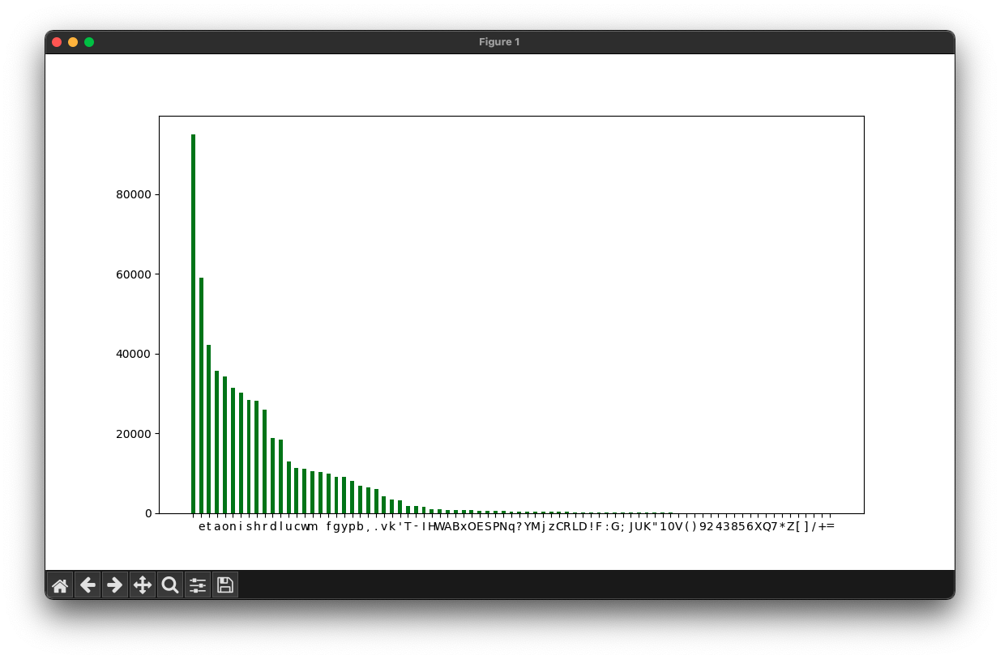

# Frequency Analysis </img>
Frequency analysis. The method is largely used as an aid to breaking monoalphabetical ciphers 

[](https://github.com/stylish-bear/frequency-analysis/actions/workflows/c-cpp.yml)

### Files
* **stat.c** - file statistics(All chars, letters, digits, lines, spaces, tabs, special symbols, frequency)
* **encrypt.c** - Vigenere cipher
* **histogram/main.py** - script for drawing the histogram of the character frequency

### How to use?
Firstly, compile that suff (I use gcc)
```shell
gcc stat.c -o analysis
gcc encrypt.c -o encrypt
```
Download or create .txt file for frequency analysis. U can use websites such as [this](http://www.lib.ru/). For example:
```shell
wget https://raw.githubusercontent.com/brunoklein99/deep-learning-notes/master/shakespeare.txt
```
And u can launch analysis binary to get file statistics
```shell
./analysis <YOUR TEXT FILE>
```
In my case:
```shell
./analysis shakespeare.txt
```
U output should be like this

```bash
user@lab~/R/frequency-analysis $ ./analysis shakespeare.txt 
Size of shakespeare.txt: 94275 chars.

Letters: 72991
Digits: 0
Lines: 2468
Spaces: 15679
Tabs: 0

Special: 3137

Lowercase chars: 
a:4574
b:1086
c:1311
d:2724
e:9222
f:1556
g:1342
h:5003
i:4234
j:66
k:547
l:3035
m:2005
n:4445
o:5579
p:987
q:51
r:4166
s:4847
t:6754
u:2299
v:924
w:1645
x:60
y:1952
z:20

Uppercase chars: 
A:367
B:144
C:31
D:39
E:27
...

```

<details>
<summary>Click to view full output</summary>
  
```bash
user@lab~/R/frequency-analysis $ ./analysis shakespeare.txt 
Size of shakespeare.txt: 94275 chars.

Letters: 72991
Digits: 0
Lines: 2468
Spaces: 15679
Tabs: 0

Special: 3137

Lowercase chars: 
a:4574
b:1086
c:1311
d:2724
e:9222
f:1556
g:1342
h:5003
i:4234
j:66
k:547
l:3035
m:2005
n:4445
o:5579
p:987
q:51
r:4166
s:4847
t:6754
u:2299
v:924
w:1645
x:60
y:1952
z:20

Uppercase chars: 
A:367
B:144
C:31
D:39
E:27
F:107
G:16
H:67
I:443
J: 2
K: 6
L:58
M:90
N:76
O:128
P:24
R:17
S:144
T:462
U:21
V: 1
W:253
Y:34

a:6.2665260101%
b:1.4878546670%
c:1.7961118494%
d:3.7319669548%
e:12.6344343823%
f:2.1317696702%
g:1.8385828390%
h:6.8542697045%
i:5.8007151567%
j:0.0904221068%
k:0.7494074612%
l:4.1580468825%
m:2.7469140031%
n:6.0897918922%
o:7.6434080914%
p:1.3522215068%
q:0.0698716280%
r:5.7075529860%
s:6.6405447247%
t:9.2531955995%
u:3.1497033881%
v:1.2659094957%
w:2.2537025113%
x:0.0822019153%
y:2.6743023112%
z:0.0274006384%

A:0.5028017153%
B:0.1972845967%
C:0.0424709896%
D:0.0534312449%
E:0.0369908619%
F:0.1465934156%
G:0.0219205107%
H:0.0917921388%
I:0.6069241413%
J:0.0027400638%
K:0.0082201915%
L:0.0794618515%
M:0.1233028730%
N:0.1041224261%
O:0.1753640860%
P:0.0328807661%
R:0.0232905427%
S:0.1972845967%
T:0.6329547478%
U:0.0287706704%
V:0.0013700319%
W:0.3466180762%
Y:0.0465810853%

A-a:6.7693277253%
B-b:1.6851392637%
C-c:1.8385828390%
D-d:3.7853981998%
E-e:12.6714252442%
F-f:2.2783630859%
G-g:1.8605033497%
H-h:6.9460618432%
I-i:6.4076392980%
J-j:0.0931621707%
K-k:0.7576276527%
L-l:4.2375087340%
M-m:2.8702168761%
N-n:6.1939143182%
O-o:7.8187721774%
P-p:1.3851022729%
R-r:5.7308435287%
S-s:6.8378293214%
T-t:9.8861503473%
U-u:3.1784740584%
V-v:1.2672795276%
W-w:2.6003205875%
Y-y:2.7208833966%
```
</details>

U will also get a file with statistics (**stats.txt**). Content of **stats.txt** in my case:

<details>
<summary>Show stats.txt content</summary>

```bash
a 0.0676932772533600032876947
b 0.0168513926374484525491198
c 0.0183858283898014823740173
d 0.0378539819977805482874625
e 0.1267142524420819005043660
f 0.0227836308585990053571626
g 0.0186050334972804866347169
h 0.0694606184324094751424443
i 0.0640763929799564329836095
j 0.0009316217067857681083970
k 0.0075762765272430847637135
l 0.0423750873395350111658749
m 0.0287021687605321203977469
n 0.0619391431820361414430586
o 0.0781877217739173322765250
p 0.0138510227288295817289936
r 0.0573084352865421764317553
s 0.0683782932142318916030163
t 0.0988615034730309216178890
u 0.0317847405844556178166943
v 0.0126727952761299338275213
w 0.0260032058746968804371414
y 0.0272088339658314038718365
```
</details>

Also u can encrypt ur text with Vigenere cipher
```bash
./encrypt shakespeare.txt
```


### Histogram
(u should have installed the requirements before running this script)
```bash
python3 histogram/main.py shakespeare.txt
```

